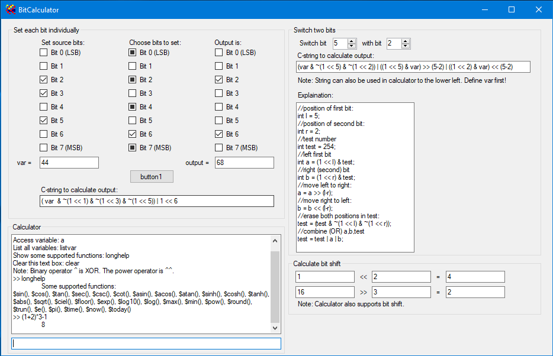

# BitCalculator

Advanced calculator which allow entering expression as string. Also provides some hints how to manipulate bits - that is where its name came from.

This program was the result of the preparation for computer engineering exam at university in 2010. First intended to get in touch with bit manipulation, it has grown to an advanced calculator with takes string inputs.
Yes, Excel can do it as well, but BitCalc starts faster!

